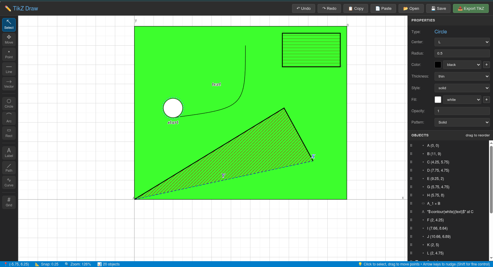

# TikZ Draw

A browser-based visual editor for creating TikZ diagrams. Draw geometric shapes, add LaTeX labels, and export clean TikZ code for use in LaTeX documents.



## Features

- **Visual Drawing Tools**: Point, Line, Vector, Circle, Arc, Rectangle, Path, Bézier Curve, Label, and Grid
- **Multi-Select**: Select multiple objects with click-to-toggle or drag-to-select box
- **Select & Move Tools**: Select objects with inside-click detection, or use Move tool for independent movement
- **Rotate Tool**: Rotate objects interactively with visual feedback (5° snap) or input exact angles
- **Multi-Object Operations**: Delete, move, rotate, copy/paste, and nudge multiple objects together
- **LaTeX Support**: Full MathJax rendering for labels and annotations
- **Pattern Support**: 12 TikZ patterns (horizontal/vertical lines, grid, dots, stars, bricks, etc.) for filled objects
- **Copy/Paste**: Duplicate single or multiple objects with all properties and relationships preserved (Ctrl+C/Ctrl+V)
- **Undo/Redo**: Full undo/redo support with 50-state history (Ctrl+Z/Ctrl+Y)
- **Arrow Key Nudging**: Precise positioning with 0.1 unit (normal) or 0.01 unit (Shift) increments
- **Clean TikZ Export**: Generates well-formatted, readable TikZ code
- **Project Save/Load**: Save your work as JSON and continue later
- **Customizable Styling**: Colors, line styles, thicknesses, arrow types, patterns, and more
- **Snap to Grid**: Configurable grid snapping for precise positioning (0.25 units)
- **Pan & Zoom**: Navigate large diagrams easily

## Getting Started

Simply open `tikz-draw.html` in a modern web browser. No installation or server required.

```bash
# Clone the repository
git clone https://github.com/yourusername/tikz-draw.git

# Open in browser
open tikz-draw.html
# or
xdg-open tikz-draw.html  # Linux
start tikz-draw.html      # Windows
```

## Tools

| Tool | Shortcut | Description |
|------|----------|-------------|
| Select | V | Select and edit objects (click inside to select) |
| Move | M | Move objects independently (auto-clones shared coordinates) |
| Rotate | O | Rotate objects around their center (5° snap, Shift for free rotation) |
| Point | P | Create coordinate points |
| Line | L | Draw line segments between points |
| Vector | A | Draw arrows/vectors between points |
| Circle | C | Draw circles (click center, drag radius) |
| Arc | R | Draw circular arcs |
| Rectangle | B | Draw rectangles |
| Label | T | Add text/LaTeX labels at points |
| Path | H | Draw multi-point paths |
| Curve | Q | Draw Bézier curves |
| Grid | G | Add a coordinate grid |

## Basic Workflow

1. **Create Points**: Select the Point tool (P) and click on the canvas to place coordinate points. Each point gets a unique name (A, B, C, etc.)

2. **Draw Shapes**: Use Line (L), Vector (A), Circle (C), or other tools. Most shapes reference existing points by name.

3. **Add Labels**: Use the Label tool (T) to add text or LaTeX math at any point. Labels support full LaTeX syntax: `$\frac{a}{b}$`, `$\alpha + \beta$`, etc.

4. **Style Objects**: Click inside any object to select it, then edit its properties in the right panel - colors, line styles, thickness, patterns, etc.

5. **Select Multiple Objects**: With Select tool (V):
   - Ctrl+click objects one-by-one to build selection (Ctrl+click again to deselect)
   - OR drag a box around objects to select all within the box
   - Click empty space to clear selection

6. **Move & Adjust**: Use the Move tool (M) to reposition objects, or use arrow keys to nudge selected objects for precise positioning. Works with single or multiple objects!

7. **Rotate Objects**: Use the Rotate tool (O) to rotate objects around their center. Click and drag in a circular motion to rotate interactively (snaps to 5°), or hold Shift for free rotation. Note: Rectangles cannot be rotated.

8. **Copy & Duplicate**: Copy objects with Ctrl+C and paste with Ctrl+V. Works with single or multiple objects - relationships are preserved!

9. **Export TikZ**: Click "Export TikZ" (or Ctrl+E) to generate LaTeX code you can copy into your document.

## Navigation

- **Pan**: Click and drag on empty canvas, or use arrow keys
- **Zoom**: Mouse wheel, or use +/- buttons in the status bar
- **Snap**: Adjust grid snap size in the status bar (click the snap value)

## Properties Panel

Select any object to view and edit its properties:

- **Points**: Position (x, y), name, visibility, color, label for export
- **Lines/Vectors**: Start/end points, color, thickness, line style, embedded labels
- **Circles**: Center, radius, stroke color, fill color, opacity, pattern
- **Rectangles**: Corners, stroke color, fill color, opacity, pattern
- **Paths**: Points, closure, stroke color, fill color, opacity, pattern, line style
- **Labels**: Position, text content, anchor position, color

## Embedded Labels

Lines and vectors can have labels attached directly to them:

1. Select a line or vector
2. Click "+ Add Label" in the properties panel
3. Click on the label entry to edit: text, position along the line (0-1), anchor, font size, color

## Line Styles

Available line styles for all stroke objects:
- solid, dashed, dotted
- dashdotted, dashdotdotted
- loosely dashed, densely dashed
- loosely dotted, densely dotted
- loosely dashdotted, densely dashdotted

## Patterns

TikZ pattern library support for filled objects (Circle, Rectangle, Path):

- **Solid** - Standard fill (no pattern)
- **Horizontal Lines** - Horizontal line pattern
- **Vertical Lines** - Vertical line pattern
- **NE Lines** - Diagonal lines (northeast)
- **NW Lines** - Diagonal lines (northwest)
- **Grid** - Grid pattern
- **Crosshatch** - Crossed lines
- **Dots** - Dot pattern
- **Crosshatch Dots** - Dots with crosshatch
- **Stars** - Five-pointed stars
- **6-Point Stars** - Six-pointed stars
- **Bricks** - Brick pattern

Patterns use the fill color for pattern color. Export automatically includes `\usetikzlibrary{patterns}` note.

## Arrow Types (Vectors)

- Stealth, latex (arrow head styles)
- Start, end, or both ends
- Adjustable arrow size

## LaTeX Labels

Labels support full LaTeX math notation via MathJax:

```latex
$\alpha$                           % Greek letters
$\frac{a}{b}$                      % Fractions
$\sqrt{x^2 + y^2}$                 % Square roots
$\int_0^\infty e^{-x} dx$          % Integrals
$\left[\frac{a}{b}\right]$         % Auto-sized brackets
```

## Export Format

The exported TikZ code is clean and well-organized:

```latex
% Note: If using patterns, add to preamble: \usetikzlibrary{patterns}

\begin{tikzpicture}

% Coordinates
\coordinate (A) at (0, 0);
\coordinate (B) at (3, 4);
\coordinate (C) at (6, 0);
\coordinate (D) at (3, 0);

% Visible Points
\fill (A) circle (2pt);
\fill (B) circle (2pt);

% Segments
\draw (A) -- (B);
\draw[thick, dashed, red] (B) -- (C);

% Vectors
\draw[-Stealth] (A) -- (C);

% Circles
\draw[fill=blue, fill opacity=0.3, pattern=horizontal lines, pattern color=blue] (D) circle (1.5);

% Labels
\node[above] at (B) {$P$};

\end{tikzpicture}
```

## Keyboard Shortcuts

### Tools

| Key | Tool |
|-----|------|
| V | Select tool |
| M | Move tool |
| O | Rotate tool |
| P | Point tool |
| L | Line tool |
| A | Vector (Arrow) tool |
| C | Circle tool |
| R | Arc tool |
| B | Rectangle tool |
| T | Label tool |
| H | Path tool |
| Q | Bézier Curve tool |
| G | Grid tool |

### Editing

| Key | Action |
|-----|--------|
| **Ctrl+C** | Copy selected object(s) |
| **Ctrl+V** | Paste (with 0.5 unit offset) - maintains relationships |
| **Ctrl+Z** | Undo |
| **Ctrl+Y** or **Ctrl+Shift+Z** | Redo |
| **Delete** / **Backspace** | Delete selected object(s) |
| **Escape** | Clear selection / Cancel operation |

### Multi-Select (with Select tool V)

| Action | Method |
|--------|--------|
| **Add to selection** | Ctrl+click object (Cmd on Mac) |
| **Remove from selection** | Ctrl+click selected object again |
| **Select multiple** | Ctrl+click objects one-by-one |
| **Box select** | Drag on empty canvas |
| **Clear selection** | Click empty space (no drag) |

### Nudging (when objects selected)

| Key | Action |
|-----|--------|
| **Arrow Keys** | Nudge all selected 0.1 units |
| **Shift + Arrow Keys** | Fine nudge all selected 0.01 units |

### Navigation

| Key | Action |
|-----|--------|
| **Arrow keys** (no selection) | Pan the canvas |
| **Mouse wheel** | Zoom in/out |
| **+** / **-** | Zoom in/out |

### File Operations

| Key | Action |
|-----|--------|
| **Ctrl+S** | Save project |
| **Ctrl+E** | Export to TikZ |

**Note**: On macOS, use **Cmd** instead of **Ctrl** for all shortcuts.

## Toolbar Buttons

The toolbar at the top of the application provides quick access to common operations:

- **↶ Undo** - Undo last action (disabled when nothing to undo)
- **↷ Redo** - Redo last undone action (disabled when nothing to redo)
- **📋 Copy** - Copy selected object (disabled when no object selected)
- **📄 Paste** - Paste from clipboard (disabled when clipboard empty)
- **📂 Open** - Load a saved project file
- **💾 Save** - Save project as JSON file
- **📤 Export TikZ** - Export as TikZ code

Button states update automatically based on current selection and clipboard status.

## Project Files

Save your work as JSON files to continue editing later:

- **Save**: Click "Save" to download a `.json` file
- **Open**: Click "Open" to load a previously saved project

Project files preserve all objects, positions, styles, and view settings.

## Tips

### Selection
- **Inside-Click Selection**: Click anywhere inside objects (circles, rectangles, closed paths) to select them - no need to click on borders
- **Multi-Select on Canvas**: Hold Ctrl (or Cmd on Mac) and click objects one-by-one to build a selection, or drag a box around objects to select them all
- **Toggle Selection**: Ctrl+click a selected object again to deselect it while keeping other selections
- **Box Select**: Drag on empty canvas to select all objects within the rectangle
- **Object List Multi-Select**: Hold Ctrl (or Cmd on Mac) and click objects in the object list to add/remove them from selection
- **Clear Selection**: Click on empty space (without dragging) or press Escape

### Movement & Positioning
- **Move Tool**: Use the Move tool (M) to move single or multiple objects. Click any selected object to drag the entire group
- **Smart Coordinate Handling**: When moving multiple objects, shared coordinates within the group move together. Coordinates shared outside the group are automatically cloned
- **Arrow Key Nudging**: Works with single or multiple selected objects - nudge all together (0.1 units normal, 0.01 units with Shift)
- **Precise Positioning**: Use the coordinate inputs in the properties panel for exact values

### Rotation
- **Interactive Rotation**: Use the Rotate tool (O) to rotate objects by clicking and dragging. The center point is calculated automatically from all selected objects
- **Angle Snapping**: Rotations snap to 5° increments by default. Hold Shift to disable snapping for free rotation
- **Visual Feedback**: While rotating, you'll see the center point (yellow), guide lines, rotation arc, and current angle display
- **Multi-Object Rotation**: Works with single or multiple selected objects - all rotate together around their collective center
- **Smart Coordinate Cloning**: Coordinates shared with non-selected objects are automatically cloned before rotation, so non-selected objects remain unaffected
- **Coordinate Rotation**: Rotations modify the actual coordinate positions (not TikZ transforms), so what you see is what you export
- **Rectangle Limitation**: Rectangles cannot be rotated due to TikZ limitations (rectangles are always axis-aligned). Convert to a path first if rotation is needed

### Copy & Paste
- **Single or Multiple**: Copy/paste works with any number of selected objects - just select and press Ctrl+C, then Ctrl+V
- **Relationship Preservation**: When copying multiple objects, their coordinate relationships are preserved in the paste
- **Quick Duplication**: Select objects, press Ctrl+C to copy, then Ctrl+V multiple times to create multiple copies

### Organization
- **Naming Points**: Points are automatically named A, B, C... You can rename them in the properties panel
- **Reordering**: Drag objects in the Objects list to change their draw order (z-index)
- **Colors**: Use the color picker or enter custom hex colors. TikZ color names (red, blue, etc.) are supported
- **Patterns**: Combine fill colors with patterns for visual variety. Pattern color matches the fill color
- **Point Labels**: Points can have both an editor name (shown in gray) and an export label (rendered in LaTeX)
- **Undo/Redo**: Don't worry about mistakes - every action can be undone with Ctrl+Z

## Browser Compatibility

Works in modern browsers with ES6+ support:
- Chrome/Chromium
- Firefox
- Safari
- Edge

Requires JavaScript enabled and internet connection (for MathJax CDN).

## License

MIT License - feel free to use, modify, and distribute.

## Contributing

Contributions welcome! Please open an issue or pull request on GitHub.
